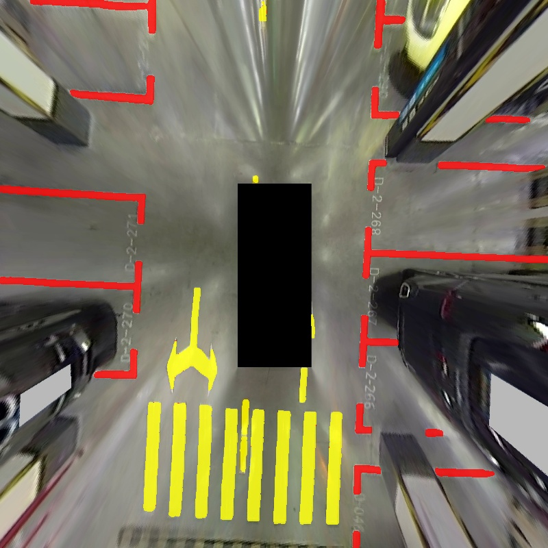

# Use of ImageProcess

## 1 Requirement
This codebase has been developed with OpenCV-4.6.0 ...

## 2 Installation
### 2.1 Create docker container
`docker run --gpus all -it -v /mnt/Data/Dataset:/hostdata/Dataset -v /mnt/work/projects:/hostdata/projects -v /tmp/.X11-unix:/tmp/.X11-unix -e DISPLAY=$DISPLAY -e GDK_SCALE -e GDK_DPI_SCALE --net=host --privileged=true --name=perception_20231204 ubuntu18.04_cu11.1_trt8.4:20231204 /bin/bash`

### 2.2 Install modules *ImageProcess*
```
bash scripts/build.x64.sh
```

## 3 Test
### 3.1 Run test
`
bash scripts/run_test.sh
`
### 3.2 Results Visualization
<div align=left>
<div align=left>


